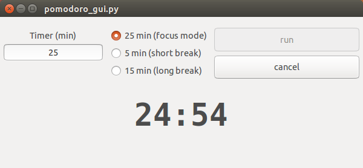
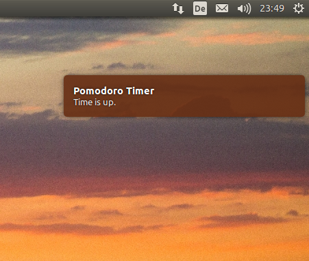

# python-pomodoro
small app for pomodoro technique with gui and gnome notification





# usage
```
#install dependencies
sudo apt-get install python3-gi

git clone https://github.com/crsqq/python-pomodoro
cd python-pomodoro
python3 pomodoro_gui.py
```
